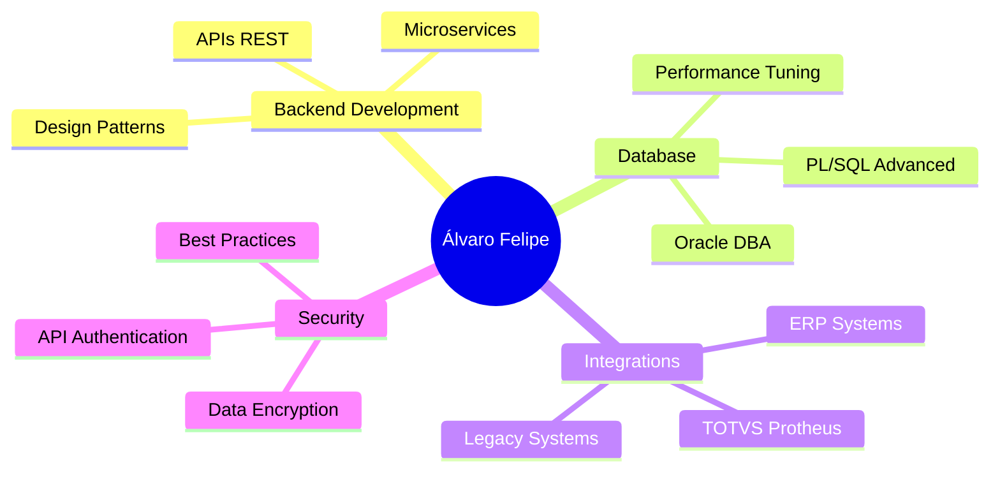

<div align="center">


[](https://git.io/typing-svg)

<p align="center">
  <a href="https://linkedin.com/in/seu-perfil">
    
  </a>
  <a href="mailto:seu-email@email.com">
    
  </a>
  <a href="https://instagram.com/alvaroflp">
    
  </a>
</p>


</div>

## 🧑‍💻 Sobre Mim

```typescript
const alvarofelipe = {
    role: "Backend Developer",
    location: "Brasil 🇧🇷",
    code: ["Delphi", "Pascal", "PL/SQL", "SQL"],
    technologies: {
        backend: {
            framework: ["Horse", "DataSnap"],
            databases: ["Oracle", "PostgreSQL", "MySQL"]
        },
        frontend: {
            desktop: ["VCL", "FireMonkey (FMX)"],
            web: ["HTML", "CSS", "JavaScript"]
        },
        integrations: ["REST API", "SOAP", "TOTVS Protheus"]
    },
    architecture: ["RESTful", "MVC", "Layered Architecture"],
    currentFocus: "Building scalable APIs and ERP integrations",
    funFact: "I turn coffee into code ☕ → 💻"
};
```


## 🛠️ Tech Stack

<div align="center">

### Backend & APIs


### Database & PL/SQL


### Desktop Development


### Tools & Others


</div>


## 🚀 Projetos em Destaque

<div align="center">

<table>
<tr>
<td width="50%">
<h3 align="center">🔌 TOTVS-API</h3>
<div align="center">
<a href="https://github.com/alvaroflp/TOTVS-API" target="_blank">

</a>
<p>


</p>
</div>
<p><strong>Delphi • Horse • Oracle</strong> - API REST para integração completa com ERP WinThor (TOTVS). Facilita comunicação entre aplicações modernas e sistemas legados.</p>
</td>

<td width="50%">
<h3 align="center">📊 QueryDBA</h3>
<div align="center">
<a href="https://github.com/alvaroflp/QueryDBA" target="_blank">

</a>
<p>

</p>
</div>
<p><strong>PL/SQL • Oracle</strong> - Coleção de queries otimizadas para monitoramento, performance tuning e administração de bancos Oracle.</p>
</td>
</tr>

<tr>
<td width="50%">
<h3 align="center">🎨 UX-FMX</h3>
<div align="center">
<a href="https://github.com/alvaroflp/UX-FMX" target="_blank">

</a>
<p>


</p>
</div>
<p><strong>Delphi • FireMonkey</strong> - Biblioteca de componentes visuais modernos para aplicações FMX multiplataforma.</p>
</td>

<td width="50%">
<h3 align="center">🎯 UX-VCL</h3>
<div align="center">
<a href="https://github.com/alvaroflp/UX-VCL" target="_blank">

</a>
<p>


</p>
</div>
<p><strong>Delphi • VCL</strong> - Componentes para modernização de interfaces desktop com foco em experiência do usuário.</p>
</td>
</tr>

<tr>
<td width="50%">
<h3 align="center">🔐 OraEncryption</h3>
<div align="center">
<a href="https://github.com/alvaroflp/OraEncryption" target="_blank">

</a>
<p>

</p>
</div>
<p><strong>PL/SQL • Security</strong> - Funções para criptografia e descriptografia segura de dados no Oracle Database.</p>
</td>

<td width="50%">
<h3 align="center">🔒 CryptoDelphi</h3>
<div align="center">
<a href="https://github.com/alvaroflp/CryptoDelphi" target="_blank">

</a>
<p>


</p>
</div>
<p><strong>Delphi • Security</strong> - Projeto educacional demonstrando conceitos de criptografia e segurança da informação.</p>
</td>
</tr>
</table>

</div>


## 📊 GitHub Analytics

<div align="center">
  
  
</div>

<div align="center">
  
</div>

<div align="center">
  
</div>


## 🎯 Expertise & Diferenciais

<div align="center">



</div>

### 💼 Principais Competências

<div align="center">

| Área | Tecnologias & Habilidades |
|------|---------------------------|
| **🔧 Backend Development** | APIs REST, Horse Framework, Design Patterns, Clean Architecture |
| **💾 Database Management** | Oracle DBA, PL/SQL, Query Optimization, Database Security |
| **🔌 Integrações** | TOTVS Protheus/WinThor, REST/SOAP APIs, Legacy Systems |
| **🖥️ Desktop Applications** | Delphi VCL/FMX, Multi-platform Development, Modern UI/UX |
| **🔐 Security** | Data Encryption, API Authentication, Secure Coding Practices |
| **📈 Performance** | Code Optimization, Database Tuning, System Architecture |

</div>


## 🏆 Conquistas GitHub

<div align="center">

[](https://github.com/ryo-ma/github-profile-trophy)

</div>


## 📫 Vamos Conversar?

<div align="center">

### 💡 Estou sempre aberto a:
✅ Novos projetos e desafios  
✅ Colaborações em código aberto  
✅ Discussões técnicas sobre arquitetura e performance  
✅ Oportunidades profissionais  

<br>

📧 **Email:** [seu-email@email.com](mailto:seu-email@email.com)  
💼 **LinkedIn:** [/in/seu-perfil](https://linkedin.com/in/seu-perfil)  
📸 **Instagram:** [@alvaroflp](https://instagram.com/alvaroflp)  
🌍 **Localização:** Brasil

<br>

### ⭐ Se você gostou dos meus projetos, considere dar uma estrela!

</div>


<div align="center">

### 🐍 Contribution Graph


</div>

<div align="center">


**💙 Obrigado pela visita!**


</div>
